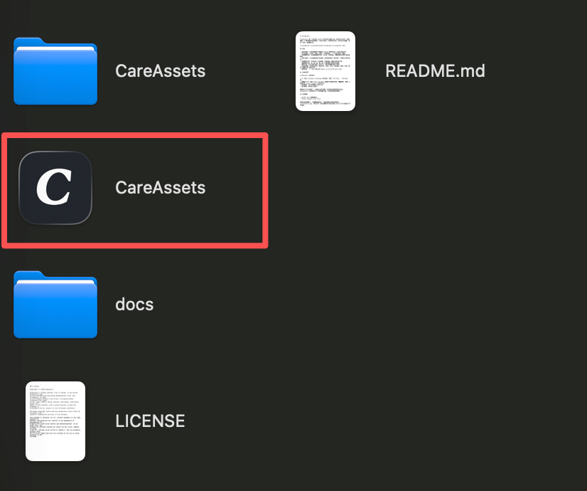
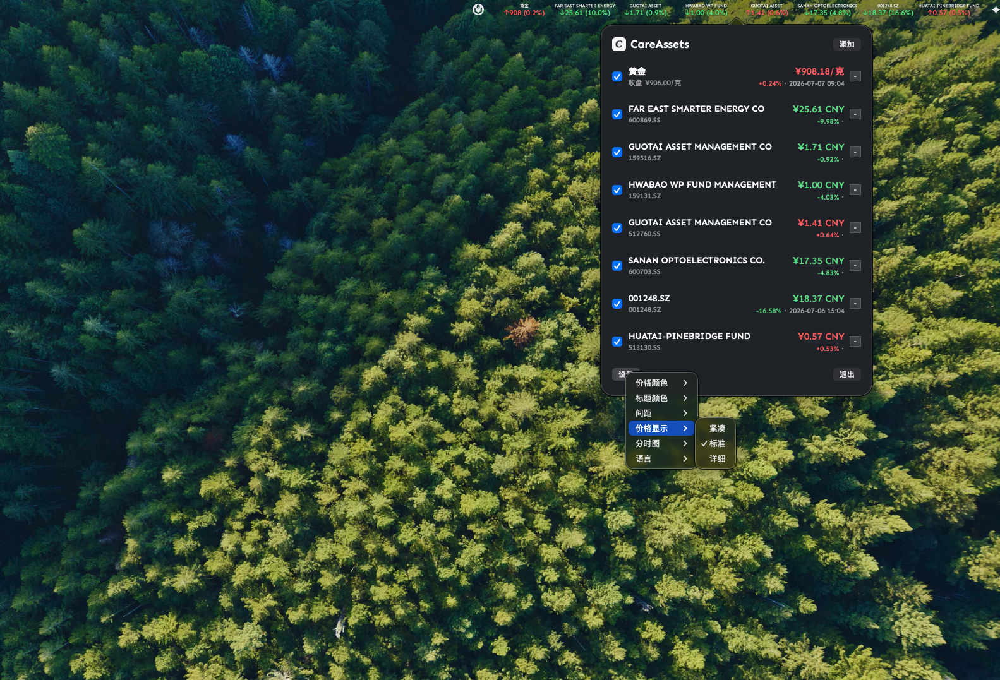

# CareAssets



如果你是普通用户，不需要构建项目，下载后直接双击根目录里的 `CareAssets.app` 即可打开；想长期使用可以把它拖到 macOS 的“应用程序”文件夹里。

CareAssets 是一个轻巧的 macOS 状态栏资产追踪工具。它把你关心的币、美股、港股、A 股和黄金收进菜单栏，平时只占很小一块状态栏空间，点开后可以搜索、添加、排序、选择展示项。



## 特点

- 轻巧状态栏：只把关键资产价格放在 macOS 顶部状态栏，不打扰当前工作。
- 多市场集合：支持币、美股、港股、A 股和黄金，一个小窗口里统一查看。
- 快速搜索添加：支持搜索股票代码、公司名、币种名称，搜索结果点击即可添加或取消。
- 自定义展示：可勾选是否显示在顶部，支持拖动排序、移出资产，列表过长时可滚动。
- 价格颜色可选：支持白色、红涨绿跌、红跌绿涨，适配不同市场习惯。
- 标题颜色可选：白、黑、蓝、黄、紫，方便适配不同菜单栏背景。
- 价格显示模式：紧凑（仅价格）、标准（价格＋涨跌幅）、详细三档可切换。
- 间距调节：状态栏资产项间距可在 36–96px 之间按档调节，适配不同屏幕密度。
- 分时图：支持在状态栏显示当日分时走势线，可选简化（方案 A）或带填充高低点标注（方案 B），也可隐藏。
- 黄金价格：中文环境下展示人民币/克，海外环境展示美元/盎司。
- 多语言界面：支持简体中文、繁体中文、英语、日语、阿拉伯语、德语、法语、韩语、葡萄牙语、西班牙语。
- 通用架构：一个 App 同时支持 Apple Silicon 和 Intel Mac。

## 支持的资产

CareAssets 当前支持：

- 币：来自 Coinbase Exchange 的交易对，例如 `BTC-USD`、`ETH-USD` 等。
- 股票和 ETF：通过 Yahoo Finance 搜索和行情接口获取，覆盖美股、港股、A 股及其他 Yahoo Finance 支持的市场。
- 国内黄金：中文市场展示人民币/克。
- 海外黄金：展示美元/盎司。

数据来自公开行情接口，可能因为源站调整、地区限制或频率限制而变化。CareAssets 只适合作为个人价格追踪工具，不构成任何投资建议。

## 系统要求

- macOS 12.0 或更高版本
- Xcode Command Line Tools

## 构建

```bash
xcode-select --install
```

```bash
cd CareAssets
./build.sh
open build/CareAssets.app
```

构建脚本会生成 `arm64 + x86_64` 通用架构 App，并使用本地 ad-hoc 签名。

手动安装到应用程序目录：

```bash
cp -R build/CareAssets.app /Applications/
```

由于当前版本没有 notarize，首次打开时 macOS 可能会拦截。可以在系统设置的“隐私与安全性”里允许打开，或右键 App 选择“打开”。

## 配置文件

CareAssets 的本地配置保存在：

```text
~/Library/Application Support/CareAssets/config.json
```

配置内容包括刷新间隔、语言、价格颜色、标题颜色、价格显示模式、间距设置、分时图显示模式和已添加资产列表。

## 隐私

CareAssets 不需要账号，也没有自己的后端服务。配置保存在本机，行情数据由 App 直接向公开数据源请求。

## 项目结构

```text
CareAssets/
  Sources/CareAssets/main.swift   # AppKit 主源码
  Resources/                      # App 图标、Logo、字体
  Info.plist
  build.sh
docs/
  careassets-screenshot.png
  careassets-install-finder.png
```

## 许可证

MIT License。详见 [LICENSE](LICENSE)。

---

## English

CareAssets is a lightweight macOS menu bar app for keeping the assets you care about one glance away. It brings crypto, US stocks, Hong Kong stocks, A-shares, and gold into a compact status bar ticker with a clean popover for search, sorting, and display control.

## Highlights

- Lightweight menu bar ticker: selected assets stay visible in the macOS status bar.
- Multi-market tracking: crypto, US stocks, Hong Kong stocks, A-shares, and gold.
- Quick asset search: search stock codes, company names, or crypto names, then add with one click.
- Custom display: choose visible menu bar assets, drag to reorder, remove assets, and scroll long lists.
- Price color modes: white, red up/green down, or red down/green up.
- Title color modes: white, black, blue, yellow, and purple for better contrast on different menu bar backgrounds.
- Price display modes: compact (price only), standard (price + change %), or detailed — switchable per preference.
- Item spacing: adjust the status bar item width from 36 to 96 px in steps to fit your screen.
- Intraday chart: display a time-series line chart for each asset in the menu bar, with scheme A (line only) or scheme B (line + fill + high/low markers), or hidden.
- Gold support: CNY/gram for Chinese market display and USD/oz for international display.
- Localized UI: Simplified Chinese, Traditional Chinese, English, Japanese, Arabic, German, French, Korean, Portuguese, and Spanish.
- Universal build: Apple Silicon and Intel Macs from one app bundle.

## Supported Assets

CareAssets currently supports:

- Crypto pairs from Coinbase Exchange, such as `BTC-USD`, `ETH-USD`, and other listed products.
- Stocks and ETFs from Yahoo Finance search/chart endpoints, including US, Hong Kong, A-share, and other supported symbols.
- Chinese gold price in CNY/gram through public gold quote endpoints.
- International gold price through Yahoo Finance gold futures data.

Data sources are public endpoints and may change or rate-limit without notice. CareAssets is a personal tracking utility, not financial advice.

## Requirements

- macOS 12.0 or later
- Xcode Command Line Tools

If you are not a developer, you do not need to build the project: download it, double-click `CareAssets.app` in the project root, and drag it into Applications if you want to keep it installed.

## Build

```bash
xcode-select --install
```

```bash
cd CareAssets
./build.sh
open build/CareAssets.app
```

The build script creates a universal `arm64 + x86_64` app bundle and ad-hoc signs it locally.

To install it manually:

```bash
cp -R build/CareAssets.app /Applications/
```

If macOS blocks the first launch because the app is not notarized, open it from System Settings > Privacy & Security, or right-click the app and choose Open.

## Configuration

CareAssets stores local configuration here:

```text
~/Library/Application Support/CareAssets/config.json
```

The config includes refresh interval, selected language, price color mode, title color mode, price display mode, item spacing, intraday chart display mode, and your tracked assets.

## Privacy

CareAssets does not require an account and does not run a backend service. It stores configuration locally and fetches market data directly from public quote endpoints.

## License

MIT License. See [LICENSE](LICENSE).
